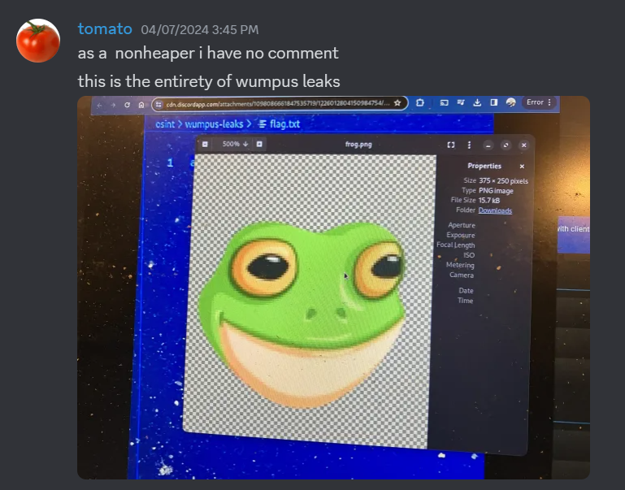
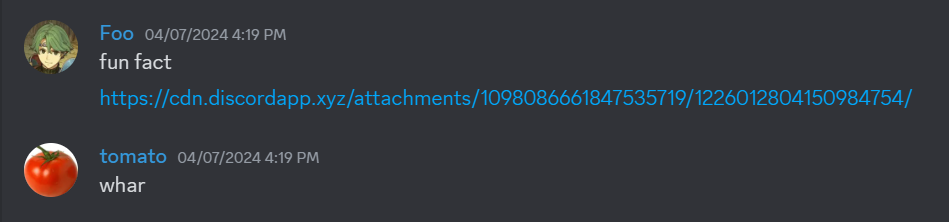
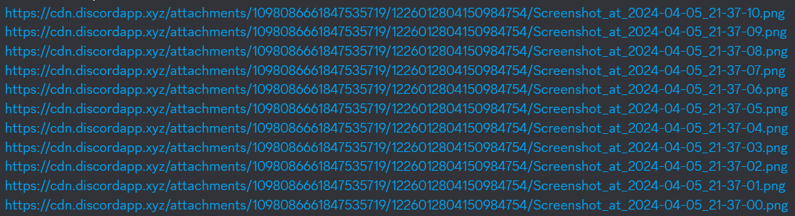
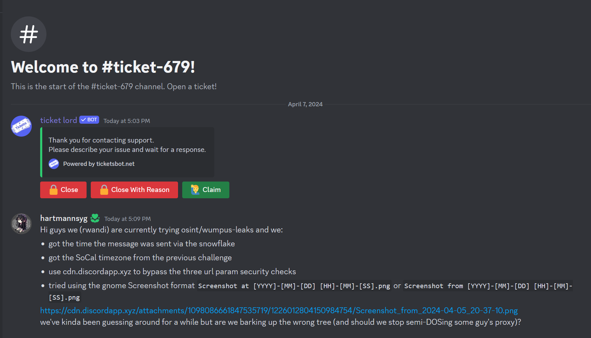
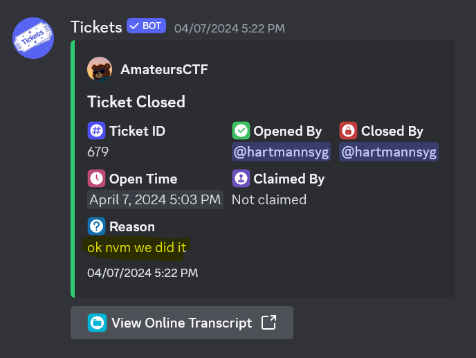
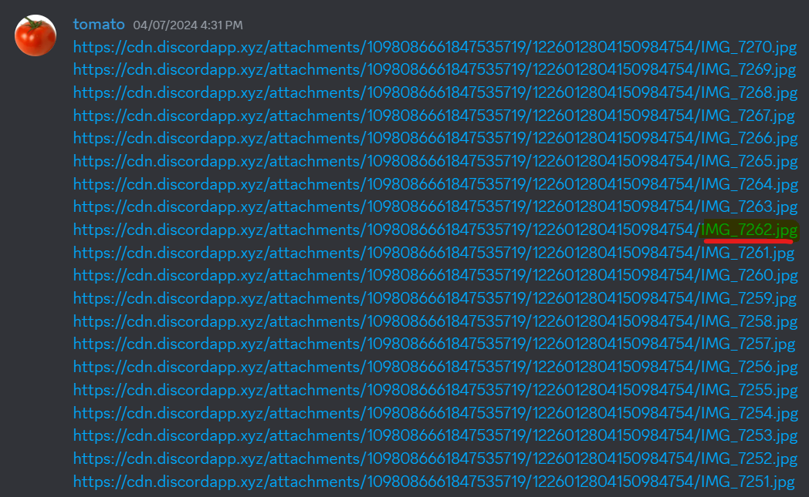
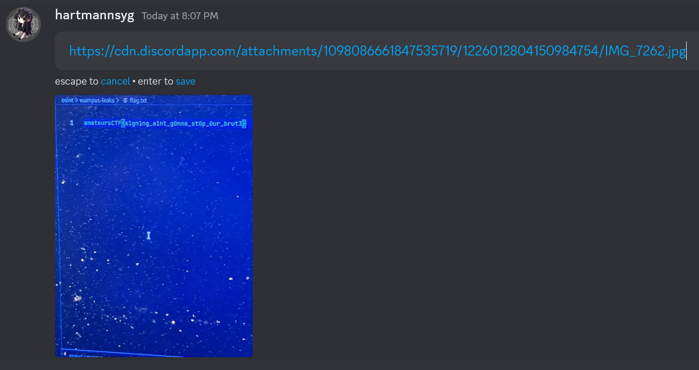

written by 

solved by , , 

> hopefully redacted enough, im kind of bad at this whole iphone photography thing so it took a few attempts to make this intentionally cringe msfrog in front of the flag, hopefully no one can guess the flag using this info
> 

We are given a "screen-shot" (a photo of computer screen of another image) with the name `IMG_7276.jpg`. Some members of our team use iOS, so we knew that this `IMG_xxxx.jpg` format was from an iOS camera (I mean they literally tell you it's an iPhone so).

We know that the URL of the image is:

https://cdn.discordapp.com/attachments/1098086661847535719/1226012804150984754/...


This tells us that the `channel_id` is `1098086661847535719` and that the `attachment_id` is `1226012804150984754`.

Of course, visiting this url did *not* give us the image.


## Finding the channel?

So let's see if we can access the channel whose channel id is `1098086661847535719`. Maybe we can go to that channel and see the image. If we send [`<#channel_id>`](https://discord.com/developers/docs/reference#message-formatting), like `<#1129311963747467356>` (which is the channel id for the osint channel on the AmateursCTF discord):


However, when we try `<#1098086661847535719>`, the channel id in question:


Perhaps we need to join access some secret discord channel, perhaps maybe even in a different server, but that does not seem likely since we have nothing hinting towards that. So we probably need to access it from the discord API. 

## The discord attachment API

Let's explore how discord attachments works by looking at an image uploaded onto discord:



If we click the "Open in Browser" at the bottom right of the image preview, we are directed to this url:


https://cdn.discordapp.com/attachments/1129684400473395221/1226437864548466688/IMG_7276.jpg?ex=662dfec5&is=661b89c5&hm=312816cf699c87c2ea548aa492317a06464009b5e442b170bfd687724f720f93&


We see that this url contains a bunch of information. Firstly, we have the filename itself, `IMG_7276.jpg`, as well as three URL parameters:

> from https://discord.com/developers/docs/reference#signed-attachment-cdn-urls:
>|PARAMETER    |DESCRIPTION                                                    |
>|-------------|---------------------------------------------------------------|
>|ex           |Hex timestamp indicating when an attachment CDN URL will expire|
>|is           |Hex timestamp indicating when the URL was issued               |
>|hm           |Unique signature that remains valid until the URL's expiration |

So in order to get the image, we need to
1. Guess the file name
2. Bypass the `ex`, `is` and `hm` checks

Ironically, bypassing the checks was the first to be cracked, as  told us about `cdn.discordapp.xyz` that could access image links without the need for `ex`, `is` and `hm`:



and with this, let the guessing begin. Surely if we hit an image, discord will load it for us. Right?


Right?


After spamming the chat, we thought we went up the wrong tree and got sidetracked. 

## Le epic sidetrack

If you want to skip this sidetrack, you can see the solution [here](#Solution).

If we looked closely, we see that the computer was using gnome based on the window. Or at least that's what  said: 


So maybe it could be a screenshot! We know the screenshot format is either:
- `Screenshot at [YYYY]-[MM]-[DD] [HH]-[MM]-[SS].png` from [this complaint](https://superuser.com/questions/1763675/how-to-change-the-default-filename-for-screenshots-with-the-new-gnome-42-screens)
- `Screenshot from [YYYY]-[MM]-[DD] [HH]-[MM]-[SS].png` from 's computer

*But doesn't that need an impossibly precise time? To the nearest second?*

We know that the attachment id of `1226437864548466688` represents a [discord snowflake](https://snowsta.mp/?l=en-us&z=x&f=b1xzfonghq-cvk), so yes, we knew the time to the nearest second!

*Wait, wouldn't we need to know the timezone?*

Thankfully, we already know that from the previous challenge that the challenge author `smashmaster` lives in southern california:

> ### osint/cherry-blossoms
> > smashmaster
>
> average southern californian reacts to DC weather. amazing scenery though at the time.
> Find the coords of this image!
> Grader Command: `nc chal.amt.rs 1771`

So we know the timezone is Pacific Time (at the time of challenge it was April so daylight savings should already be in effect, so the timezone is `PDT` which is `UTC−07:00`).

I felt like I was onto something. More guessing ensued:



At this point the chat had been thoroughly spammed (the images shown only represent the tip of the iceberg when it came to the amount of guessing). At this point spamming the chat further would be stupid, so  made a script:

```py
urls = []
exts = [".jpg", ".heic"]
for m in range(38,0, -1):
    for s in range(59, -1, -1):
        link = f"https://cdn.discordapp.xyz/attachments/1098086661847535719/1226012804150984754/Screenshot_from_2024-04-05_20-{str(m).zfill(2)}-{str(s).zfill(2)}.png"
        urls.append(link)
        if requests.get(link).status_code!=404:
            print(link)
```

(I think we also tried UTC timezone as well)

Unfortunately, we found literally nothing. We were quite desperate, so I opened a goddamn ticket:



Thankfully after a finite amount of time,  finally solved it. (and I closed the ticket):



## Solution

As it turns out we were extremely dumb and discord does not embed images if you send a billion links that don't work:



(as it turns out `IMG_7262.jpg` was the correct file name)

> To be fair,  had pointed out that in the image in the background, the vscode editor vertical line was not perfectly straight
> 
> so it couldn't have been a screenshot

So anyways, going to [`https://cdn.discordapp.xyz/attachments/1098086661847535719/1226012804150984754/IMG_7262.jpg`](https://cdn.discordapp.xyz/attachments/1098086661847535719/1226012804150984754/IMG_7262.jpg) gives:


~~Anyways the moral of the story is don't overcomplicate things~~

## wait there's an even easier way

I was aware that when posting discord media urls, you did not have to specify the three additonal url parameters. However, I (mistakenly) thought that this only applied to images where you had access to that channel/server.

So anyways, if you simply type `https://cdn.discordapp.com/attachments/1098086661847535719/1226012804150984754/IMG_7262.jpg` in discord:


