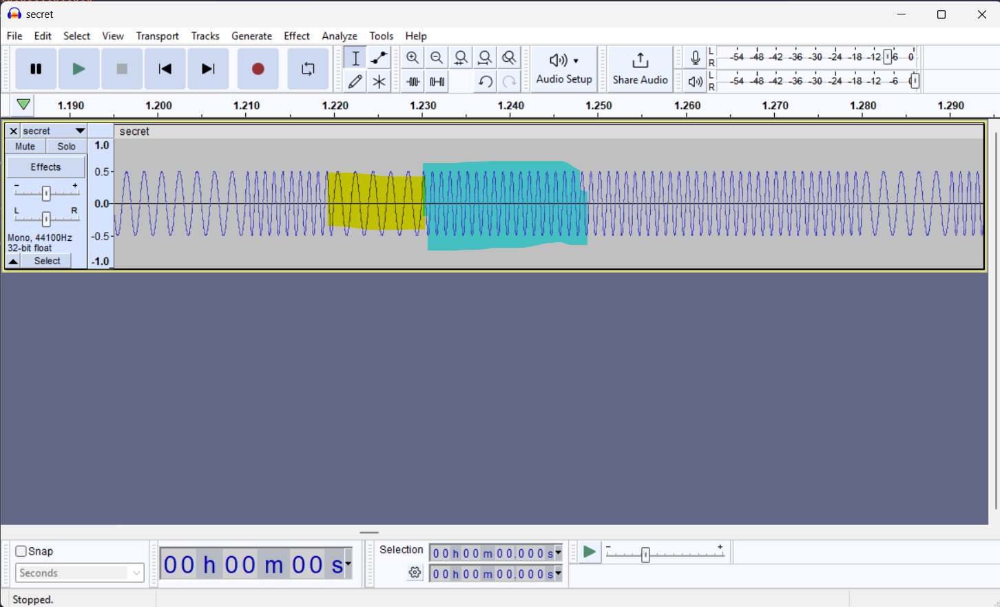

by 

> beeeep beeeep beeeep beep beeeep beep beeeep beeeep beeeep beeeep beep beeeep beeeep beep beeeep beep. (Take note that sample rate of audio is 44.1kHz and duration of each beep is 0.01s)

This challenge is a frequency modulation challenge and designed to be easy.

We are given an attached audio file secret.wav and the goal of this challenge is to extract the hidden flag within the audio. When playing the audio, it sounds like a bunch of beeps and while it does sound like morse, those who pay closer attention to the challenge description and name, would realise that the bits of the flag has been embedded within the beeps within the audio file with the 1 bit being represented by a beep with a higher frequency and 0 bit being represented with a lower frequency. 

This can be seen via the following screenshot where we can see some audio waves having a higher frequency (the part highlighted in blue) than the others (the part highlighted in yellow) thus showing a certain pattern.



We can write the following script to extract these bits from the flag (or if you really too lazy to write python script, manually write down the bits of the flag on a piece of paper 💀).

```py
from scipy.io.wavfile import read
import numpy as np

def read_audio(file): #reading audio file using scipy.io.wavfile.read()
    sample_rate,data=read(file)
    return sample_rate,data

def calc_freq(signal_chunk,sample_rate): #this function just calculates the frequency of each beep lasting 0.01s
    zero_crossing=np.where(np.diff(np.signbit(signal_chunk)))[0]
    num_crossing=len(zero_crossing)
    duration=len(signal_chunk)/sample_rate
    estimated_freq=num_crossing/(2*duration)
    return estimated_freq

sample_rate,modulated_wave=read_audio("secret.wav")
sample_rate=44100
duration=0.01

bits=""

for i in range(0,len(modulated_wave),int(sample_rate*duration)):
    chunk=modulated_wave[i:i+441] #getting each chunk of audio based on the sample rate
    detected_freq=calc_freq(chunk,sample_rate) 
    if (detected_freq==float(950)): #this value 950 is the higher freuqency of the beep representing bit 1 and can be derived from just printing out detected_freq.
        bits+="1"
    else:
        bits+="0"

data=''.join([chr(int(bits[i:i+8],2)) for i in range(0,len(bits),8)]) #converting array of bits to chars of flag
print(data) #print flag
```

Running this script, we get the flag ```blahaj{On3s_aNd_z3ros_mAk3_tH3_wHole_w0rLd_rUN_aRouNd}```. 

Ngl, it was kinda funny seeing people complain about this chall thinking it was morse code or ppl using radio software to analyse the audio coz they overthink when it's a simple freq modulation chall.
