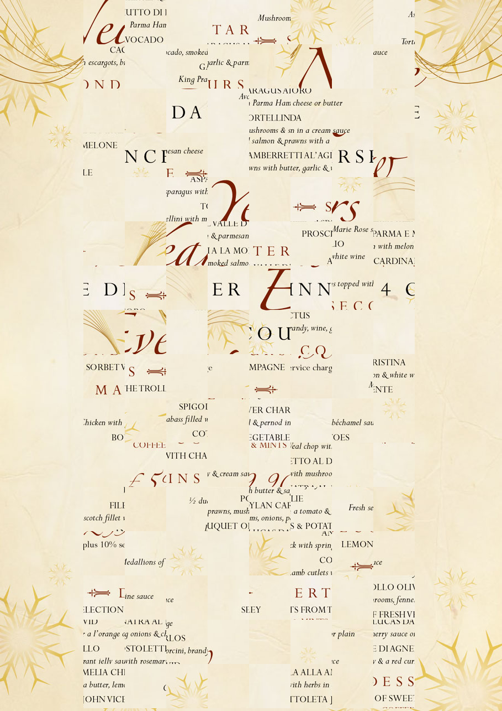
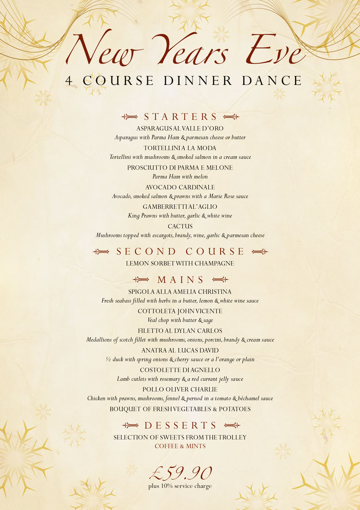

by 

> Dear Haj,  
How have your holidays been? If you have no plans for New Year's Eve, would you like to join us? All of our friends will be there. It will be a fun party!  
Here is the location: https://docs.google.com/presentation/d/12PRILGsZBu3irFufoidmHN5uQXi9Uyzj5vvKqzChnfM

# Files


def insert(startpos, image1, image2, original, new, width, height):
    #insert a piece from the first image 
    #into another position in the second image
    image2[
        startpos[0] + new[0] * height:startpos[0] + (new[0]+1) * height,
        startpos[1] + new[1] * width:startpos[1] + (new[1]+1) * width
        ] = image1[
        startpos[0] + original[0] * height:startpos[0] + (original[0]+1) * height, 
        startpos[1] + original[1] * width:startpos[1] + (original[1]+1) * width
        ]
import cv2
import numpy as np

flag = "blahaj{????????????????????????}"
assert len(flag) == 32  

image = cv2.imread('menu.jpg')
piece_width = image.shape[1] // 12
piece_height = image.shape[0] // 16
startx = image.shape[1] // 6
image2 = image.copy()

#horizontal shuffling
for v in range(8):
    positions = [0,1,2,3,4,5,6,7]
    char = ord(flag[31-v])
    for h in range(8):
        newPos = positions[char % (8-h)]
        positions.remove(newPos)
        insert((0,startx),image, image2, (v+8,h), (v+8, newPos), piece_width, piece_height)
for v in range(8):
    positions = [0,1,2,3,4,5,6,7]
    char = ord(flag[23-v])
    for h in range(8):
        newPos = positions[char % (8-h)]
        positions.remove(newPos)
        insert((0,startx),image, image2, (v,h), (v, newPos), piece_width, piece_height)
image3 = image2.copy()

#vertical shuffling
for h in range(8):
    positions = [0,1,2,3,4,5,6,7]
    char = ord(flag[15-h])
    for v in range(8):
        newPos = positions[char % (8-v)]
        positions.remove(newPos)
        insert((0,startx),image2, image3, (v,h), (newPos, h), piece_width, piece_height)
for h in range(8):
    positions = [0,1,2,3,4,5,6,7]
    char = ord(flag[7-h])
    for v in range(8):
        newPos = positions[char % (8-v)]
        positions.remove(newPos)
        insert((0,startx),image2, image3, (v+8,h), (newPos+8, h), piece_width, piece_height)

cv2.imwrite("puzzle.png", image3)


The resulting image:

# Getting the original image

Search `"A LA", "with melon", "parma ham", "escargots", "smoked salmon", "& parmesan"` (words found in the menu) to find the restaurant:

https://www.valledororestaurant.co.uk/

The original intended way was to partially solve the puzzle, then search using one of the dishes' descriptions. (this is why the google slide exists)

There are many ways to search for it.

Then we can find find the restaurant's new years eve menu:

# Extracting the flag

Each character of the flag moves 8 pieces around. Each piece is moved to a new position based on the remainder when the character's ascii value is divided by 8 through 1. The last 16 characters are used to shift pieces horizontally, then the first 16 characters to shift vertically.

To get the last 16 characters, we see how far each piece moved horizontally from the original. To get the first 16 characters, we see how far each piece moved vertically from the horizontally shuffled version.


def get_piece_position(piece, pieces):
    for v in range(len(pieces)):
        for h in range(len(pieces[0])):
            if np.array_equal(pieces[v][h], piece):
                return (v,h)
    print("No piece found!")
    return (-1,-1)
        
import cv2
import numpy as np

image = cv2.imread('menu.jpg')
image2 = cv2.imread('puzzle.png')
piece_width = image.shape[1] // 12
piece_height = image.shape[0] // 16
startx = image.shape[1] // 6
originalpieces = [[None for j in range(8)] for i in range(16)]
scrambledpieces = [[None for j in range(8)] for i in range(16)]
halfscrambled = [[None for j in range(8)] for i in range(16)]
flagmodulus = [[None for j in range(8)] for i in range(32)]
flag = ""
for i in range(16):
    for j in range(8):
        originalpieces[i][j] = image[i * piece_height:(i+1) * piece_height, startx + j * piece_width:startx + (j+1) * piece_width]
        scrambledpieces[i][j] = image2[i * piece_height:(i+1) * piece_height, startx + j * piece_width:startx + (j+1) * piece_width]
#horizontal correcting
for v in range(8):
    positions = [0,1,2,3,4,5,6,7]
    for h in range(8):
        newh = get_piece_position(originalpieces[v][h], scrambledpieces)[1]
        halfscrambled[v][newh] = originalpieces[v][h]
        flagmodulus[23-v][h] = positions.index(newh)
        positions.remove(newh)
for v in range(8):
    positions = [0,1,2,3,4,5,6,7]
    for h in range(8):
        newh = get_piece_position(originalpieces[v+8][h], scrambledpieces)[1]
        halfscrambled[v+8][newh] = originalpieces[v+8][h]
        flagmodulus[31-v][h] = positions.index(newh)
        positions.remove(newh)
        
        
#vertical correcting
for h in range(8):
    positions = [0,1,2,3,4,5,6,7]
    for v in range(8):
        newv = get_piece_position(halfscrambled[v][h], scrambledpieces)[0]
        flagmodulus[15-h][v] = positions.index(newv)
        positions.remove(newv)
for h in range(8):
    positions = [0,1,2,3,4,5,6,7]
    for v in range(8):
        newv = get_piece_position(halfscrambled[v+8][h], scrambledpieces)[0]
        flagmodulus[7-h][v] = positions.index(newv-8)
        positions.remove(newv-8)

#flag extraction
for i in range(32):
    for j in range(128):
        correct = True
        for k in range(8):
            if j % (8-k) != flagmodulus[i][k]:
                correct = False
                break
        if (correct):
            flag += chr(j)
            break
print(flag)


# Alternative Solutions
To those who fully solved the puzzle and/or tracked the piece positions by hand, I salute you.