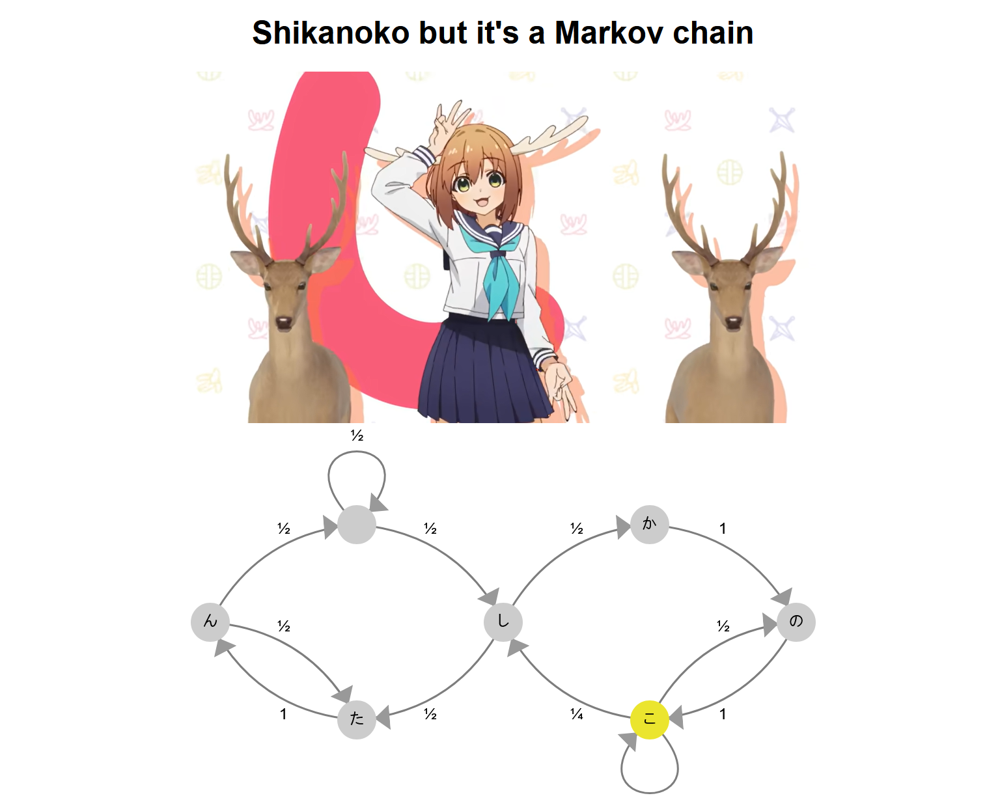

by 

> I almost went insane testing this. しかのこのこのここしたんたんしかのこのこのここしたんたんしかのこのこのここしたんたんしかのこのこのここしたんたんしかのこのこのここしたんたんしかのこのこのここしたんたんしかのこのこのここしたんたんしかのこのこのここしたんたん

The challenge was hosted on http://shikanoko.c1.blahaj.sg/:



From the source code given, we can see that we basically need this Markov Chain to go 'shikanokonokonokokoshitantan' twice:


    const setState = (next: FSMState) => {
        currentStateRef.current = next;
        history += next.label
        let requirement = 'しかのこのこのここしたんたん'+'しかのこのこのここしたんたん';
        if (history.slice(-requirement.length) == requirement) {
            alert('blahaj{example_flag}')
        }
    }


`setState` is being called everytime the state changes, and the label gets appended the `history`, which gets checked.

However, if you do the math, there is only a 1 in $2^{19}$ chance of the chain giving you the flag. Considering each "shikanokonokonoko koshitantan" is ~3 seconds, this means that roughly speaking, you would expect to get the flag by continuously playing this website for 18 days.

Now if you have, say, a 100 tabs open, you _could_ get it in several hours (Let me know if anyone managed to brute force it this way), but there are faster ways.

## Intended Solution

The intended solution is to notice/fuck around and find out that clicking the button sets the state:


        const node = svg.append("g")
            .attr("class", "nodes")
            .selectAll("circle")
            .data(states)
            .enter().append("circle")
            .attr("id", d => `node_${d.id}`)
            .attr("class", "node")
            .attr("r", 20)
            .attr("cx", d => d.x)
            .attr("cy", d => d.y)
            .on("click", (event, d) => {
                if(timeout.current)
                    clearTimeout(timeout.current);
                d3.select(`#node_${currentStateRef.current.id}`).classed("current-node", false);
                d3.select(`#node_${currentStateRef.current.id}`).classed("current-node", true);
                setState(d)
                setSeek(currentStateRef.current.start);
                timeout.current = setTimeout(transition, currentStateRef.current.duration * 1000);
            });


With this, you can construct a macro that just presses the buttons for you...
<details>
<summary>In my case, I used <code>puppeteer</code> to press them for me</summary>


```js
const puppeteer = require('puppeteer');

(async () => {
	const browser = await puppeteer.launch({ headless: false });
	const page = await browser.newPage();
	await page.goto('http://188.166.198.74:30035'); // replace with actual url


    async function shikanokonokonokokoshitantan() {
        await page.click('#node_shi');
        await page.click('#node_ka');
        await page.click('#node_no');
        await page.click('#node_ko');
        await page.click('#node_no');
        await page.click('#node_ko');
        await page.click('#node_no');
        await page.click('#node_ko');
        await page.click('#node_ko');
        await page.click('#node_shi');
        await page.click('#node_ta');
        await page.click('#node_n');
        await page.click('#node_ta');
        await page.click('#node_n');
    }
    // note: this is really RNG, sometimes I get it consistently while other times I have to run this 10 times
    await shikanokonokonokokoshitantan()
    await shikanokonokonokokoshitantan()

    page.on('dialog', async dialog => {
        //get alert message
        console.log(dialog.message());
        //accept alert
        await dialog.accept();
        await browser.close();
    })
})();
```

</details>

While this challenge gets mentioned as a "web" challenge, *this* is why its a misc challenge - there's nothing really *web* about it.

## Alternative Solutions

I wouldn't really call this an "Unintended Solution" since its also a perfectly fine way to go about it.  solved it by reverse-engineering the build code provided to get the flag.