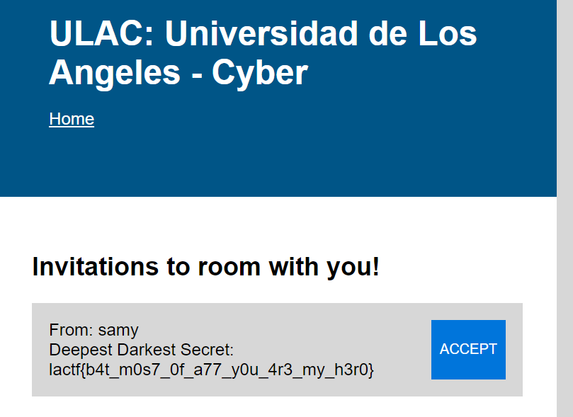

solved by 

I'm too lazy to illustrate this, but the username and name field of accounts are vulnerable to xss. Raw html is reflected via the "view invitations" page.

So, if we can get the admin bot to visit our page, we can trigger an xss that lets the admin send a request to us.

Idea:
- create user1 with normal username (hartmannsyg02)
- create user2 whose username xss that sends request to user1
- user2 send invitation to samy
- adminbot: view invitation page
- samy gets xss-ed, sends a request to user1
- view deepdarksecret in user1

our xss payload into the username is:




When that user ^ sends a request to the admin bot and the admin bot receives it, it sends an invite to us (in this case `hartmannsyg02`):

