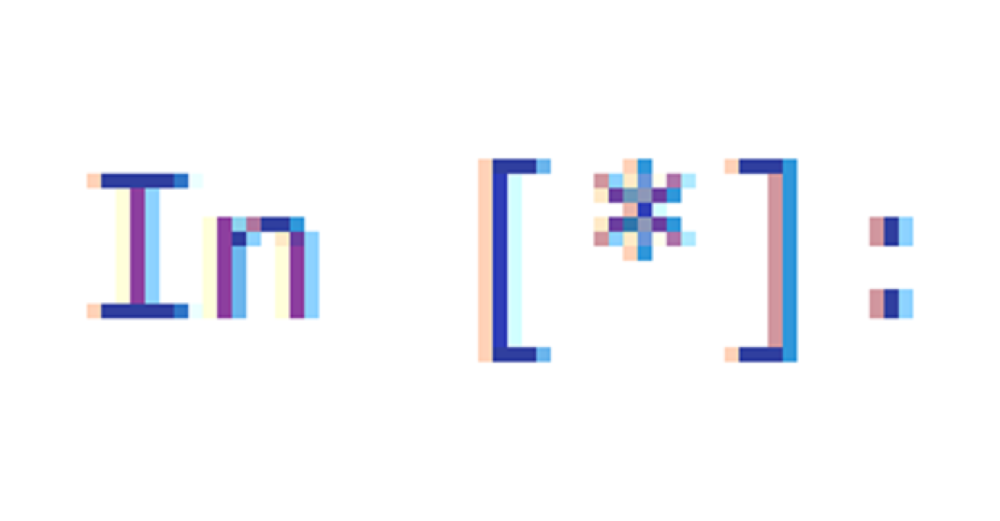

written by 

> The maze trials were just the start. As a master of mazes, you find yourself still confined in a maze. At least you've got some superpowers this time...
> nc challs.nusgreyhats.org 31112

The only algo challenge in this ctf out of the ≈3 programming challenges and I thought it would be quick and easy because another team already solved it, but it remained at 1 solve during the 4 hours I spent on it.

## Overview

The context is that we are given a maze, and we have to find the length of the shortest path from the bottom right corner to the top left corner. But we have *superpowers*, meaning we can phase through a wall a few times.

The first question looks like this:
```
--------------------------------------------------
LEVEL 1:
 ┏━━━━━━━━━━━━━━━┳━━━┓
 ┃               ┃   ┃
 ┣━━━━━━━━━━━    ┃   ┃
 ┃               ┃   ┃
 ┃   ━━━━┳━━━━━━━┛   ┃
 ┃       ┃           ┃
 ┣━━━┓   ┗━━━━━━━    ┃
 ┃   ┃               ┃
 ┃   ┗━━━━━━━━━━━    ┃
 ┃                   ┃
 ┗━━━━━━━━━━━━━━━━━━━┛

You have been given 0 wall-phases

Hurry! How many steps does it take to escape?
```

The size of the maze increases with each question, and the timeout is like 5 seconds, so the time limit is real.

## Idea

My first idea was to use recursion to solve the maze, because recursion is easy to code. The length of the path to a certain square is the smallest length of the path to any adjacent square, +1.

We can represent the maze in 3D, with each layer being the number of wall-phases we have left. When we go through a wall, we jump down a layer. If we are at the bottom layer, we solve the maze as normal.

## Implementation details

First we need a simple representation of the maze. 

```py
from pwn import *
import numpy as np
conn = remote("challs2.nusgreyhats.org", 31112)
for k in range(50):
    useless = conn.recvuntil("--------------------------------------------------").decode()
    data = conn.recvuntil("Hurry! How many steps does it take to escape?").decode().split("\n")
    rec_time = time.time()
    maze_length = (len(data[2]) - 2) // 4
    maze_height = (len(data[2:-4]) - 1) // 2
    maze = np.zeros((2 * maze_length + 1,2 * maze_height + 1))
    for i in range(2 * maze_length + 1):
        for j in range(2 * maze_height + 1):
            if data[2 + j][2 * i + 1] == " " and data[2+j][2*i] == " " and (i < 2*maze_length or data[2+j][2*i+1] == " "):
                maze[j,i] = 1

    phases = int(data[-3][20]) 
    #I forgot numbers can have more than 1 digit
    if balls[-3][21] != " ":
        phases = phases * 10 + int(balls[-3][21])
    #But they can't have more than 2 digits in this universe
```

Because the walls are made of a lot of different characters, we check for empty spaces instead. The 0s in the array will represent walls, and the 1s will represent spaces.

Next we make the recursion algorithm:
```py
def mazerun(maze, x, y, phases, wherefrom):
    if x == (maze.shape[0]-3) // 2 and y == (maze.shape[1]-3) // 2:
        return 0
    #starting space
    if maze[2 * x + 1,2 * y + 2] == 1 and wherefrom != "right":
        top = mazerun(maze, x, y+1, phases, "left")
    elif phases > 0 and wherefrom != "right" and y != (maze.shape[1]-3) // 2:
        #Do not phase out if at the edge
        top = mazerun(maze, x, y+1, phases-1, "left")
    if maze[2 * x + 1,2 * y] == 1 and wherefrom != "left":
        bottom = mazerun(maze, x, y-1, phases, "right")
    elif phases > 0 and wherefrom != "left" and y != 0:
        bottom = mazerun(maze, x, y-1, phases-1, "right")
    if maze[2 * x + 2,2 * y + 1] == 1 and wherefrom != "bottom":
        right = mazerun(maze, x+1, y, phases, "top")
    elif phases > 0 and wherefrom != "bottom" and x != (maze.shape[0]-3) // 2:
        #Do not phase out if at the edge
        right = mazerun(maze, x+1, y, phases-1, "top")
    if maze[2 * x,2 * y + 1] == 1 and wherefrom != "top":
        left = mazerun(maze, x-1, y, phases, "bottom")
    elif phases > 0 and wherefrom != "top" and x != 0:
        left = mazerun(maze, x-1, y, phases-1, "bottom")
    steps = min(top,bottom,left,right) + 1
    return steps
```
We track the direction we come from so we do not backtrack and create an infinite loop.

For each direction, we check if there is a wall in the way, if not it continues as per normal, if there is a wall it will subtract 1 wall-phase.

Because the number of wall-phases is limited, I wasn't too concerned about the extra time needed to consider the phases.


> What actually happened

## Running out of time

It turns out recursion is slow (who would have guessed?) so we pull out the recursion + memory combo.

```py
    memo = np.full((maze_length,maze_height,phases+1), 981)
    #Arbitrary large value
```

```py
def mazerun(maze, x, y, phases, wherefrom):
    if x == (maze.shape[0]-3) // 2 and y == (maze.shape[1]-3) // 2:
        return 0
    if memo[x,y,phases] != 981:
        return memo[x,y,phases]
    if maze[2 * x + 1,2 * y + 2] == 1 and wherefrom != "right":
        top = mazerun(maze, x, y+1, phases, "left")
    elif phases > 0 and wherefrom != "right" and y != (maze.shape[1]-3) // 2:
        top = mazerun(maze, x, y+1, phases-1, "left")
    else:
        top = 981
    if maze[2 * x + 1,2 * y] == 1 and wherefrom != "left":
        bottom = mazerun(maze, x, y-1, phases, "right")
    elif phases > 0 and wherefrom != "left" and y != 0:
        bottom = mazerun(maze, x, y-1, phases-1, "right")
    else:
        bottom = 981
    if maze[2 * x + 2,2 * y + 1] == 1 and wherefrom != "bottom":
        right = mazerun(maze, x+1, y, phases, "top")
    elif phases > 0 and wherefrom != "bottom" and x != (maze.shape[0]-3) // 2:
        right = mazerun(maze, x+1, y, phases-1, "top")
    else:
        right = 981
    if maze[2 * x,2 * y + 1] == 1 and wherefrom != "top":
        left = mazerun(maze, x-1, y, phases, "bottom")
    elif phases > 0 and wherefrom != "top" and x != 0:
        left = mazerun(maze, x-1, y, phases-1, "bottom")
    else:
        left = 981
    steps = min(top,bottom,left,right) + 1
    return steps
```

If the value already exists in memory, we do not need to search anymore. This actually saves enough time to not timeout the connection.

## Memory problems

But actually, sometimes the memory was confidently incorrect. And then we would end up getting a path length higher than it should be.
```
I think you can run faster! You could've followed this map instead and got 60 steps!
 ┏━━━┳━━━┳━━━━━━━━━━━┳━━━━━━━━━━━━━━━━━━━━━━━━━━━━━━━┳━━━━━━━┳━━━━━━━━━━━━━━━━━━━━━━━━━━━┳━━━━━━━━━━━━━━━━━━━━━━━━━━━━━━━━━━━┓
 ┃XX ┃   ┃           ┃                               ┃       ┃                           ┃                                   ┃
 ┃XX ┃   ╹   ━━━━┓   ┃   ┏━━━━━━━━━━━━━━━┳━━━┓   ╻   ╹   ╻   ┃   ┏━━━━━━━┓   ┏━━━━━━━┓   ┃   ━━━━━━━━━━━━━━━━┳━━━    ┏━━━    ┃
 ┃XX ┃           ┃   ┃   ┃               ┃   ┃   ┃       ┃   ┃   ┃       ┃   ┃       ┃   ┃                   ┃       ┃       ┃
 ┃XX ┣━━━━━━━┓   ┃   ╹   ╹   ┏━━━┳━━━    ┃   ┃   ┣━━━    ┣━━━┛   ┣━━━    ┃   ┃   ╻   ┗━━━┻━━━┳━━━━━━━━━━━┓   ┃   ╻   ┣━━━━━━━┫
 ┃XX ┃       ┃   ┃           ┃   ┃       ┃   ┃   ┃       ┃       ┃       ┃   ┃   ┃           ┃           ┃   ┃   ┃   ┃       ┃
 ┃XX ╹   ╻   ┣━━━┻━━━━━━━┳━━━┛   ┃   ┏━━━┛   ┃   ┃   ━━━━┫   ┏━━━┛   ╻   ┃   ╹   ┣━━━┓   ╻   ┗━━━━━━━    ┃   ┃   ┗━━━┛   ╻   ┃
 ┃XX     ┃   ┃           ┃       ┃   ┃       ┃   ┃       ┃   ┃       ┃   ┃       ┃   ┃   ┃               ┃   ┃           ┃   ┃
 ┣━━━━━━━┫   ╹   ┏━━━┓   ┃   ┏━━━┛   ┗━━━    ┃   ┗━━━━━━━┫   ┃   ╻   ┗━━━┻━━━━━━━┫   ┃   ┗━━━━━━━━━━━━━━━┛   ┣━━━━━━━┳━━━┛   ┃
 ┃XX     ┃       ┃   ┃   ┃   ┃               ┃           ┃   ┃   ┃               ┃   ┃                       ┃       ┃       ┃
 ┃XX ┏━━━┻━━━━━━━┫   ┃   ┃   ╹   ┏━━━━━━━┓   ┗━━━┳━━━    ┃   ┗━━━╋━━━━━━━    ╻   ┃   ┗━━━━━━━┳━━━━━━━━━━━━━━━┛   ┏━━━┛   ╻   ┃
 ┃XX ┃           ┃   ┃   ┃       ┃       ┃       ┃       ┃       ┃           ┃   ┃           ┃                   ┃       ┃   ┃
 ┃XX ╹   ╻   ╻   ┃   ┃   ┃   ━━━━┫   ╻   ┃   ┏━━━┛   ╻   ┗━━━┓   ╹   ┏━━━━━━━┛   ┗━━━    ╻   ┗━━━━━━━━━━━━━━━┓   ┃   ┏━━━┛   ┃
 ┃XX     ┃   ┃   ┃   ┃   ┃       ┃   ┃   ┃   ┃       ┃       ┃       ┃                   ┃                   ┃   ┃   ┃       ┃
 ┣━━━━━━━┛   ┃   ╹   ┃   ┣━━━━━━━┛   ┃   ┗━━━┫   ━━━━╋━━━━━━━┻━━━┳━━━┛   ┏━━━━━━━━━━━━━━━┻━━━━━━━━━━━┳━━━    ┃   ┃   ┗━━━━━━━┫
 ┃XX         ┃       ┃   ┃           ┃       ┃       ┃           ┃       ┃                           ┃       ┃   ┃           ┃
 ┃XX ━━━━┳━━━┻━━━┓   ┃   ┃   ┏━━━━━━━┻━━━┓   ┗━━━┓   ┃   ┏━━━┓   ╹   ┏━━━┫   ━━━━━━━━━━━━┳━━━━━━━┓   ┗━━━┓   ╹   ┗━━━┳━━━┓   ┃
 ┃XX     ┃       ┃   ┃   ┃   ┃           ┃       ┃   ┃   ┃   ┃       ┃   ┃               ┃  
```
> The challenge mocking us, how funny.

Because the algorithm prevents backtracking, we would sometimes block the shortest path and end up saving into memory the wrong value for a tile. Because we never check again, we would never know.

There was no easy fix for this, so I ended up forcing the program to update all the adjacent tiles whenever a new value for a tile is saved into a memory (and do so recursively, to save the entire zone that got corrupted initially).
```py
def updatenode(maze, x, y, phases, value):
    if memo[x,y,phases] >= value:
        memo[x,y,phases] = value
    if maze[2 * x + 1,2 * y + 2] == 1:
        if 981 > memo[x,y+1,phases] >= value + 1:
            updatenode(maze, x, y+1, phases, value + 1)
    if maze[2 * x + 1,2 * y] == 1:
        if 981 > memo[x,y-1,phases] >= value + 1:
            updatenode(maze, x, y-1, phases, value + 1)
    if maze[2 * x + 2,2 * y + 1] == 1:
        if 981 > memo[x+1,y,phases] >= value + 1:
            updatenode(maze, x+1, y, phases, value + 1)
    if maze[2 * x,2 * y + 1] == 1:
        if 981 > memo[x-1,y,phases] >= value + 1:
            updatenode(maze, x-1, y, phases, value + 1)
    return
```
It will terminate if the values for the adjacent tiles are all less than or equal to the current tile, because that means there is no new correct minimum.

## Final code
```py
from pwn import *
import numpy as np

conn = remote("challs2.nusgreyhats.org", 31112)
for k in range(50):
    start_time = time.time()
    data = conn.recvuntil("--------------------------------------------------").decode()
    balls = conn.recvuntil("Hurry! How many steps does it take to escape?").decode().split("\n")
    rec_time = time.time()
    maze_length = (len(balls[2]) - 2) // 4
    maze_height = (len(balls[2:-4]) - 1) // 2
    maze = np.zeros((2 * maze_length + 1,2 * maze_height + 1))
    for i in range(2 * maze_length + 1):
        for j in range(2 * maze_height + 1):
            if balls[2 + j][2 * i + 1] == " " and balls[2+j][2*i] == " " and (i < 2*maze_length or balls[2+j][2*i+1] == " "):
                maze[j,i] = 1

    phases = int(balls[-3][20])
    if balls[-3][21] != " ":
        phases = phases * 10 + int(balls[-3][21])
    memo = np.full((maze_length,maze_height,phases+1), 981)
    conn.recv()
    mid_time = time.time()
    solve = mazerun(maze,0,0,phases,"left")
    conn.sendline(str(int(solve)))
    print(k+1,"Start", rec_time-start_time,"Mid", mid_time - rec_time,"End", time.time() - mid_time)
after = conn.recv()
```
```py
def mazerun(maze, x, y, phases, wherefrom):
    updatetop = False
    updateright = False
    updateleft = False
    updatebottom = False
    if x == (maze.shape[0]-3) // 2 and y == (maze.shape[1]-3) // 2:
        return 0
    if memo[x,y,phases] != 981:
        return memo[x,y,phases]
    if maze[2 * x + 1,2 * y + 2] == 1 and wherefrom != "right":
        top = mazerun(maze, x, y+1, phases, "left")
    elif phases > 0 and wherefrom != "right" and y != (maze.shape[1]-3) // 2:
        top = mazerun(maze, x, y+1, phases-1, "left")
    else:
        top = 981
    if maze[2 * x + 1,2 * y] == 1 and wherefrom != "left":
        bottom = mazerun(maze, x, y-1, phases, "right")
    elif phases > 0 and wherefrom != "left" and y != 0:
        bottom = mazerun(maze, x, y-1, phases-1, "right")
    else:
        bottom = 981
    if maze[2 * x + 2,2 * y + 1] == 1 and wherefrom != "bottom":
        right = mazerun(maze, x+1, y, phases, "top")
    elif phases > 0 and wherefrom != "bottom" and x != (maze.shape[0]-3) // 2:
        right = mazerun(maze, x+1, y, phases-1, "top")
    else:
        right = 981
    if maze[2 * x,2 * y + 1] == 1 and wherefrom != "top":
        left = mazerun(maze, x-1, y, phases, "bottom")
    elif phases > 0 and wherefrom != "top" and x != 0:
        left = mazerun(maze, x-1, y, phases-1, "bottom")
    else:
        left = 981
    steps = min(top,bottom,left,right) + 1
    updatenode(maze,x,y,phases,steps)
    return steps
def updatenode(maze, x, y, phases, value):
    if memo[x,y,phases] >= value:
        memo[x,y,phases] = value
    if maze[2 * x + 1,2 * y + 2] == 1:
        if 981 > memo[x,y+1,phases] >= value + 1:
            updatenode(maze, x, y+1, phases, value + 1)
    if maze[2 * x + 1,2 * y] == 1:
        if 981 > memo[x,y-1,phases] >= value + 1:
            updatenode(maze, x, y-1, phases, value + 1)
    if maze[2 * x + 2,2 * y + 1] == 1:
        if 981 > memo[x+1,y,phases] >= value + 1:
            updatenode(maze, x+1, y, phases, value + 1)
    if maze[2 * x,2 * y + 1] == 1:
        if 981 > memo[x-1,y,phases] >= value + 1:
            updatenode(maze, x-1, y, phases, value + 1)
    return
```
The result:
```
\n--------------------------------------------------\nCongratulations! You've made it out of the maze! Your determination, courage, and problem-solving skills have led you to freedom. Now, embrace the next chapter of your journey with the same resilience and bravery. The maze may be behind you, but the adventure continues!\n\ngrey{g1ad3rs_pha5erS_y0u_hAvE_jo1n3d_tH3_m4ze_eSc4p3rs!}\n
```
