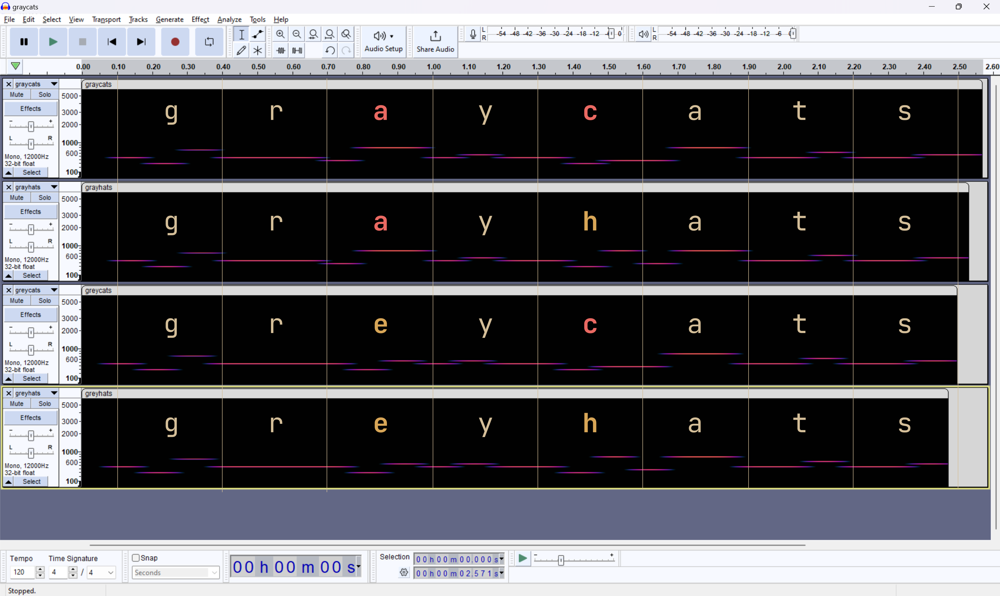
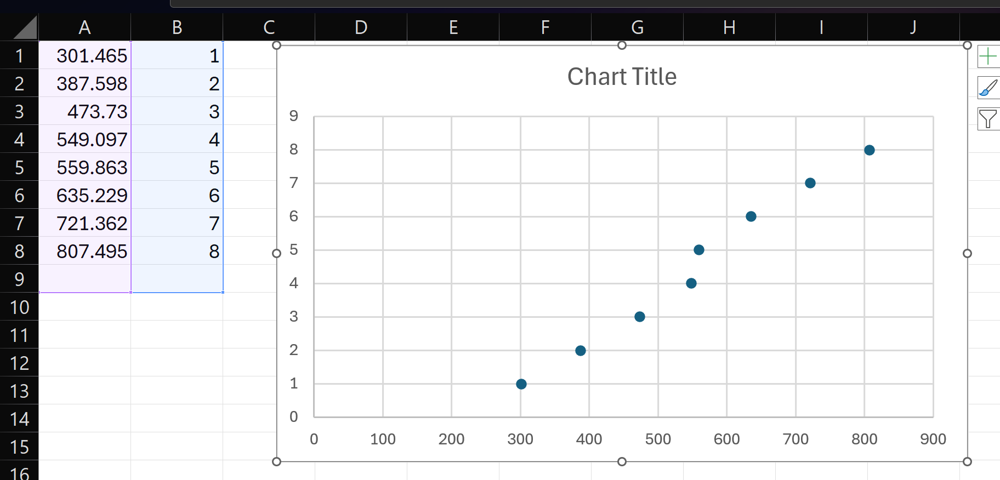

solved by 

> What kind of music is this?
> Warning: Audio file may be loud!
> https://storage.googleapis.com/greyctf-challs/dist-tones.zip

We are given five music files:


.
├── flag.flac
├── graycats.flac
├── grayhats.flac
├── greycats.flac
└── greyhats.flac


We assume that each `gr(e/a)y(c/h)ats.flac` encodes the text `gr(e/a)y(c/h)ats` via the beeps and boops in the audio file.

If we throw them into audacity, we notice that it *appears* that each character encodes to three frequency levels:



## Parsing out frequency levels

Earlier,  asked ChatGPT for code to parse frequencies from an audio file so now we have this:
```py
import librosa
import numpy as np
def extract_frequencies(audio_file, interval_length=0.1):
    # Load the audio file
    y, sr = librosa.load(audio_file)

    # Calculate the total number of intervals
    total_intervals = int(len(y) / (sr * interval_length))

    frequencies = []

    # Extract frequencies for each interval
    for i in range(total_intervals):
        start = int(i * sr * interval_length)
        end = int((i + 1) * sr * interval_length)
        
        # Compute the Short-Time Fourier Transform (STFT)
        stft = librosa.stft(y[start:end])
        
        # Calculate the magnitude spectrogram
        mag = librosa.magphase(stft)[0]

        # Find the frequency with maximum magnitude
        max_freq = librosa.fft_frequencies(sr=sr)
        max_mag_idx = mag.argmax(axis=0)
        max_freq_component = max_freq[max_mag_idx]

        # Take the median frequency
        median_freq = np.median(max_freq_component)

        frequencies.append(median_freq)

    return frequencies

f1 = extract_frequencies("graycats.flac")[1:]
f2 = extract_frequencies("grayhats.flac")[1:]
f3 = extract_frequencies("greycats.flac")[1:]
f4 = extract_frequencies("greyhats.flac")[1:]
flag = extract_frequencies("flag.flac")[1:]
```

If we collect all the frequencies among all the files, we see we have 8 frequencies:


frequencies = set()
for f in f1:
    frequencies.add(f)
for f in f2:
    frequencies.add(f)
for f in f3:
    frequencies.add(f)
for f in f4:
    frequencies.add(f)
for f in flag:
    frequencies.add(f)
frequencies = sorted(frequencies)
print(frequencies)



[301.46484375, 387.59765625, 473.73046875, 549.0966796875, 559.86328125, 635.2294921875, 721.3623046875, 807.4951171875]




It seems we have equally spaced frequencies, except for 549.0966796875 and 559.86328125 being really close to each other (spoiler alert: this is relevant)

## Spot the pattern

Since we have 8 frequencies, we seem to have some sort of base-8-esque encoding. So let's try assinging each frequency from 0-7 and seeing if a pattern emerges:

|char|1st|2nd|3rd|follow pattern?|
|:-:|:-:|:-:|:-:|:-:|
|**`a`**|**`1`**|**`7`**|**`7`**|➖|
|b|2|0|0|⋮|
|**`c`**|**`2`**|**`0`**|**`1`**|✅|
|d|2|0|2|⋮|
|**`e`**|**`2`**|**`0`**|**`3`**|✅|
|f|2|0|4|⋮|
|**`g`**|**`2`**|**`0`**|**`6`**|❌|
|**`h`**|**`2`**|**`0`**|**`7`**|❌|
|⋮|⋮|⋮|⋮|⋮|
|**`r`**|**`2`**|**`2`**|**`2`**|❌|
|**`s`**|**`2`**|**`2`**|**`4`**|❌|
|**`t`**|**`2`**|**`2`**|**`5`**|❌|
|⋮|⋮|⋮|⋮|⋮|
|**`y`**|**`2`**|**`4`**|**`2`**|❌|

We see that our "pattern" breaks at `g`. In fact, we see that from `r` to `s`, we skip frequency level 3 entirely. This suggests that we should combined frequency level 3 and 4. (This happens to be the two suspiciously close frequencies we mentioned from earlier.) If we combined the two close frequencies from earlier, we get:

|char|1st|2nd|3rd|follow pattern?|
|:-:|:-:|:-:|:-:|:-:|
|**`a`**|**`1`**|**`6`**|**`6`**|➖|
|b|2|0|0|⋮|
|**`c`**|**`2`**|**`0`**|**`1`**|✅|
|d|2|0|2|⋮|
|**`e`**|**`2`**|**`0`**|**`3`**|✅|
|f|2|0|4|⋮|
|**`g`**|**`2`**|**`0`**|**`5`**|✅|
|**`h`**|**`2`**|**`0`**|**`6`**|✅|
|⋮|⋮|⋮|⋮|⋮|
|**`r`**|**`2`**|**`2`**|**`2`**|✅|
|**`s`**|**`2`**|**`2`**|**`3`**|✅|
|**`t`**|**`2`**|**`2`**|**`4`**|✅|
|⋮|⋮|⋮|⋮|⋮|
|**`y`**|**`2`**|**`3`**|**`2`**|✅|

This is a base-7-esque pattern. Actually as a matter of fact, `166` in base 7 corresponds with the ascii code for `a` (67). So if we just map it to ascii, we can get the flag:


def lvl(f):
    if f == 559.86328125:
        return 3
    freqs = [301.46484375, 387.59765625, 473.73046875, 549.0966796875, 635.2294921875, 721.3623046875, 807.4951171875]
    return freqs.index(f)

furagu = ''
start = 0
for i in range(len(flag)//3):
    n1 = lvl(flag[start])
    n2 = lvl(flag[start+1])
    n3 = lvl(flag[start+2])
    furagu+=predict(n1,n2,n3)
    start+=3
print(furagu)



grey{why_th3_7fsk_fr3qu3ncy_sh1ft_0349jf0erjf9jdsgdfg}
